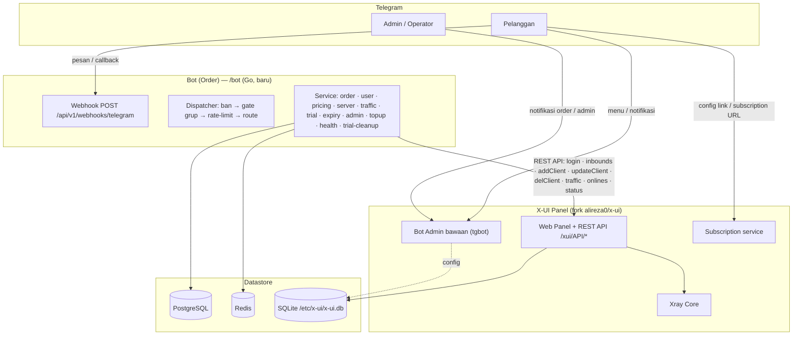
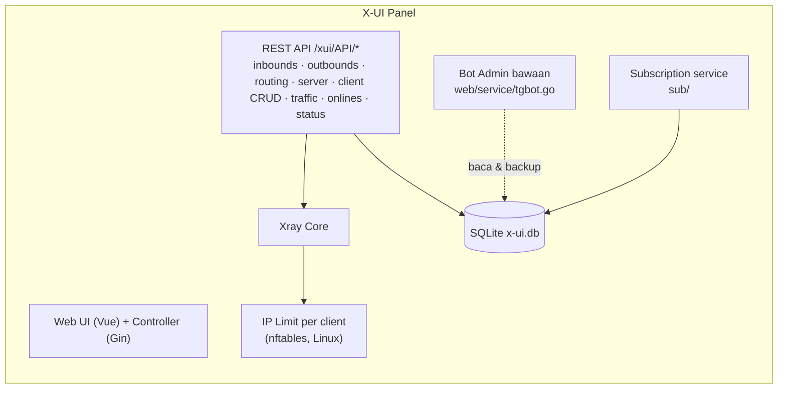
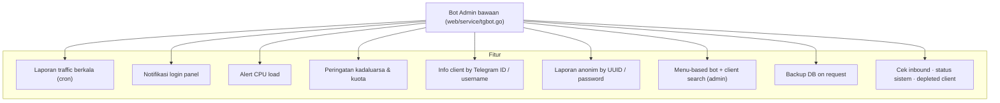
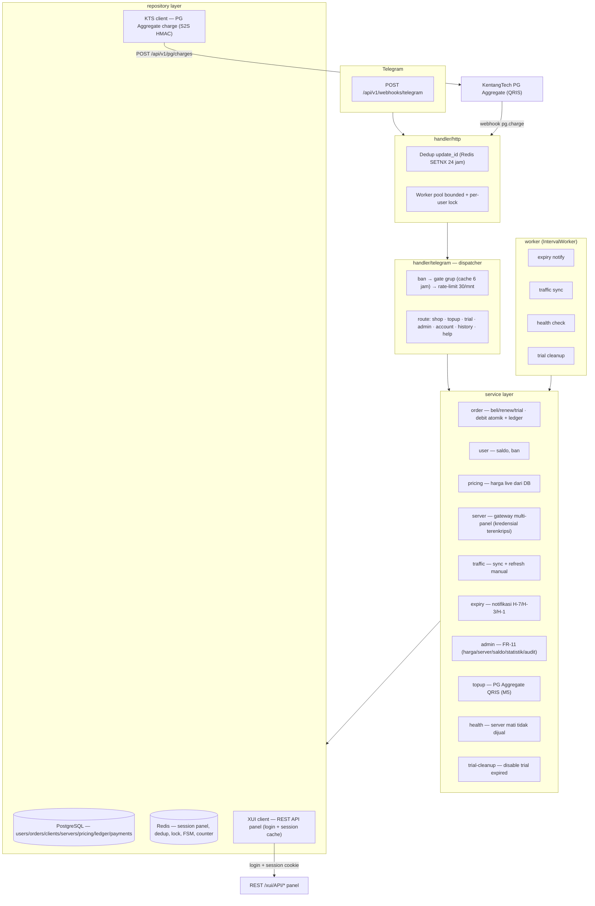

# X-UI — Kentang Tech Fork

**An Advanced Web Panel • Built on Xray Core** — **fork** dari
[`alireza0/x-ui`](https://github.com/alireza0/x-ui) dengan tambahan **Bot
(Order)**: Telegram auto-order bot (Go, webhook-only) di direktori `/bot`.

> **Disclaimer:** Project ini hanya untuk pembelajaran & komunikasi personal —
> jangan digunakan untuk tujuan ilegal.

**Struktur repo:**

| Direktori | Isi |
|-----------|-----|
| `/` | Panel X-UI (fork `alireza0/x-ui`): web panel, REST API, Xray Core, Bot Admin bawaan, subscription service |
| `/bot` | **Bot (Order)** — Telegram bot auto-order (Go, PostgreSQL + Redis, webhook-only). Dokumentasi lengkap: [`bot/README.md`](bot/README.md) |
| `/docs` | PRD & UAT checklist Bot (Order) |

Dokumentasi upstream (API routes, install panel, env vars, dsb.) dipertahankan
apa adanya di bawah.

## Arsitektur (Skema)

### Stack Overview



### Skema X-UI Panel (fork)



### Skema Bot Admin Bawaan (tgbot panel)

Bot Telegram yang sudah tertanam di panel (dikonfigurasi lewat Web Panel:
token, admin chat ID, cron notifikasi, backup, ambang CPU).



### Skema Bot (Order) — /bot (baru)



## Install Bot (Order)

Bot auto-order berada di `/bot` (modul Go mandiri — **tidak menyentuh** source,
DB, maupun proses panel; komunikasi ke panel hanya lewat REST API).
Dokumentasi lengkap: [`bot/README.md`](bot/README.md).

### Prasyarat

- **Go 1.26+** (toolchain sesuai `AGENTS.md`)
- **PostgreSQL 16 + Redis** native di host (systemd `postgresql@16-main` di
  `127.0.0.1:5432`, `redis-server` di `127.0.0.1:6379`)
- Domain **HTTPS publik** untuk webhook Telegram (Nginx + TLS)
- X-UI Panel yang bisa diakses bot (host + port panel, kredensial admin)

### Langkah

```bash
# 1. Setup database & redis (sekali saja)
sudo -u postgres psql -c "CREATE USER bot WITH PASSWORD 'bot';"
sudo -u postgres psql -c 'CREATE DATABASE bot OWNER bot;'
sudo -u postgres psql -c 'CREATE DATABASE bot_test OWNER bot;'
sudo systemctl enable --now redis-server

# 2. Konfigurasi
cd bot
cp .env.example .env
# isi: BOT_TOKEN, BOT_DOMAIN (HTTPS), WEBHOOK_SECRET, DATABASE_URL, REDIS_URL,
#      ENCRYPTION_KEY, ADMIN_IDS, NOTIFICATION_GROUP_ID, PANEL_1_* (panel X-UI),
#      KTS_BASE_URL, KTS_API_KEY, KTS_SECRET (PG Aggregate payment, M5)

# 3. Build & uji
 go build ./... && go vet ./...
 go test -race ./...

# 4. Jalankan (port default 8443)
go run ./cmd/bot
# atau binary: go build -o bot ./cmd/bot && ./bot
```

Webhook Telegram **terdaftar otomatis saat boot** (setWebhook + verifikasi).
Health check: `curl http://127.0.0.1:8443/api/v1/health`.

### TLS (Nginx) — syarat webhook Telegram

Webhook Telegram hanya menerima HTTPS. Proxy Nginx → `127.0.0.1:8443`:

```bash
sudo certbot certonly --standalone -d bot-xui.kentangtechstore.com
# mount certs ke ./certs (fullchain.pem + privkey.pem), sesuaikan nginx.conf
```

### Docker Compose (produksi)

```bash
cd bot
docker compose up -d --build
docker compose ps
curl https://<BOT_DOMAIN>/health
```

> Compose menjalankan **bot + nginx** dengan `network_mode: host` — PostgreSQL &
> Redis dipinjam dari service host (bukan container).

## Quick Overview
| Features                               |      Enable?       |
| -------------------------------------- | :----------------: |
| Multi-Protocol                         | :heavy_check_mark: |
| Multi-Language                         | :heavy_check_mark: |
| Multi-Client/Inbound                   | :heavy_check_mark: |
| Advanced Traffic Routing Interface     | :heavy_check_mark: |
| Client & Traffic & System Status       | :heavy_check_mark: |
| Date & Traffic Cap Based on First Use  | :heavy_check_mark: |
| REST API                               | :heavy_check_mark: |
| TG Bot (DB backup + admin + client)    | :heavy_check_mark: |
| Subscription Service (link + info)     | :heavy_check_mark: |
| Search in Deep                         | :heavy_check_mark: |
| Dark/Light Theme                       | :heavy_check_mark: |
| IP Limit per client (Linux Only)       | :heavy_check_mark:* |
  
## Install & Upgrade to Latest Version

```sh
bash <(curl -Ls https://raw.githubusercontent.com/alireza0/x-ui/master/install.sh)
```

## Install Legacy Version

**Step 1:** To install an old version, use following installation command. e.g., version `1.8.0`:

```sh
VERSION=1.8.0 && bash <(curl -Ls "https://raw.githubusercontent.com/alireza0/x-ui/$VERSION/install.sh") $VERSION
```

## Manual Install & Upgrade

<details>
  <summary>Click for details</summary>
  
### Usage

1. Make sure the required packages are installed (the install script does this automatically, so this step is only needed for manual installs):

```sh
# Debian/Ubuntu
apt-get update && apt-get install -y wget curl tar tzdata cron ca-certificates nftables
# CentOS/Alma/Rocky/Fedora
# yum install -y wget curl tar tzdata cronie ca-certificates nftables
# Arch/Manjaro
# pacman -Syu --noconfirm wget curl tar tzdata cronie ca-certificates nftables
```

> `ca-certificates` is needed for HTTPS/TLS connections, and `nftables` is required by the per-client IP limit feature.

2. To download the latest version of the compressed package directly to your server, run the following command:

```sh
ARCH=$(uname -m)
case "${ARCH}" in
  x86_64 | x64 | amd64) XUI_ARCH="amd64" ;;
  i*86 | x86) XUI_ARCH="386" ;;
  armv8* | armv8 | arm64 | aarch64) XUI_ARCH="arm64" ;;
  armv7* | armv7) XUI_ARCH="armv7" ;;
  *) XUI_ARCH="amd64" ;;
esac

wget https://github.com/alireza0/x-ui/releases/latest/download/x-ui-linux-${XUI_ARCH}.tar.gz
```

3. Once the compressed package is downloaded, execute the following commands to install or upgrade x-ui:

```sh
ARCH=$(uname -m)
case "${ARCH}" in
  x86_64 | x64 | amd64) XUI_ARCH="amd64" ;;
  i*86 | x86) XUI_ARCH="386" ;;
  armv8* | armv8 | arm64 | aarch64) XUI_ARCH="arm64" ;;
  armv7* | armv7) XUI_ARCH="armv7" ;;
  *) XUI_ARCH="amd64" ;;
esac
cd /root/
rm x-ui/ /usr/local/x-ui/ /usr/bin/x-ui -rf
tar zxvf x-ui-linux-${XUI_ARCH}.tar.gz
chmod +x x-ui/x-ui x-ui/bin/xray-linux-* x-ui/x-ui.sh
cp x-ui/x-ui.sh /usr/bin/x-ui
cp -f x-ui/x-ui.service /etc/systemd/system/
mv x-ui/ /usr/local/
systemctl daemon-reload
systemctl enable x-ui
systemctl restart x-ui
```

</details>

## Install using Docker

<details>
   <summary>Click for details</summary>

### Usage

**Step 1:** Install Docker

```shell
curl -fsSL https://get.docker.com | sh
```

**Step 2:** Clone the Project Repository:

   ```sh
   git clone https://github.com/alireza0/x-ui.git
   cd x-ui
   ```

**Step 3:** Start the Service

   ```sh
   docker compose up -d
   ```

   OR

```shell
mkdir x-ui && cd x-ui
docker run -itd \
    -p 54321:54321 -p 443:443 -p 80:80 \
    -e XRAY_VMESS_AEAD_FORCED=false \
    -v $PWD/db/:/etc/x-ui/ \
    -v $PWD/cert/:/root/cert/ \
    --name x-ui --restart=unless-stopped \
    alireza7/x-ui:latest
```

update to latest version

   ```sh
    cd x-ui
    docker compose down
    docker compose pull x-ui
    docker compose up -d
   ```

remove x-ui from docker 

   ```sh
    docker stop x-ui
    docker rm x-ui
    cd --
    rm -r x-ui
   ```

> Build your own image

```shell
docker build -t x-ui .
```

</details>

## Languages

- English
- Chinese
- Farsi
- Russian
- Vietnamese

## Features

- Supports protocols including VLESS, VMess, Trojan, Shadowsocks, Dokodemo-door, SOCKS, HTTP, Wireguard
- Supports XTLS protocols, including Vision and REALITY
- An advanced interface for routing traffic, incorporating PROXY Protocol, Reverse, External, and Transparent Proxy, along with Multi-Domain, SSL Certificate, and Port
- Support auto generate Cloudflare WARP using Wireguard outbound
- An interactive JSON interface for Xray template configuration
- An advanced interface for inbound and outbound configuration
- Clients’ traffic cap and expiration date based on first use
- Per-client IP limit that blocks connections beyond an allowed number of concurrent IPs (powered by nftables)
- Displays online clients, traffic statistics, and system status monitoring
- Deep database search
- Displays depleted clients with expired dates or exceeded traffic cap
- Subscription service with (multi)link
- Importing and exporting databases
- One-Click SSL certificate application and automatic renewal
- HTTPS for secure access to the web panel and subscription service (self-provided domain + SSL certificate)
- Dark/Light theme

## Preview


## API Routes

<details>
  <summary>Click for details</summary>

### Usage

- `/login` with `PUSH` user data: `{username: '', password: ''}` for login
- `/xui/API/inbounds` base for following actions:

| Method | Path                               | Action                                    |
| :----: | ---------------------------------  | ----------------------------------------- |
| `GET`  | `"/"`                              | Get all inbounds                          |
| `GET`  | `"/get/:id"`                       | Get inbound with inbound.id               |
| `POST` | `"/add"`                           | Add inbound                               |
| `POST` | `"/del/:id"`                       | Delete inbound                            |
| `POST` | `"/update/:id"`                    | Update inbound                            |
| `POST` | `"/addClient/"`                    | Add client to inbound                     |
| `POST` | `"/:id/delClient/:clientId"`       | Delete client by clientId\*               |
| `POST` | `"/updateClient/:clientId"`        | Update client by clientId\*               |
| `GET`  | `"/getClientTraffics/:email"`      | Get client's traffic                      |
| `GET`  | `"/getClientTrafficsById/:id"`     | Get client's traffic By ID                |
| `POST` | `"/:id/resetClientTraffic/:email"` | Reset client's traffic                    |
| `POST` | `"/resetAllTraffics"`              | Reset traffics of all inbounds            |
| `POST` | `"/resetAllClientTraffics/:id"`    | Reset inbound clients traffics (-1: all)  |
| `POST` | `"/delDepletedClients/:id"`        | Delete inbound depleted clients (-1: all) |
| `POST` | `"/import"`                        | Import an inbound from exported data      |
| `POST` | `"/onlines"`                       | Get online users ( list of emails )       |


- The field `clientId` should be filled by:
  - `client.id` for VMess and VLESS
  - `client.password` for Trojan
  - `client.email` for Shadowsocks


- `/xui/API/outbounds` base for following actions:

| Method | Path                               | Action                                    |
| :----: | ---------------------------------  | ----------------------------------------- |
| `GET`  | `"/"`                              | Get all outbounds                         |
| `POST` | `"/add"`                           | Add outbound                              |
| `POST` | `"/del/:id"`                       | Delete outbound                           |
| `POST` | `"/update/:id"`                    | Update outbound                           |
| `POST` | `"/setFirst/:id"`                  | Move outbound to the top of the list      |
| `POST` | `"/:id/resetTraffic"`              | Reset outbound's traffic                  |
| `POST` | `"/resetAllTraffics"`             | Reset traffics of all outbounds           |
| `POST` | `"/onlines"`                       | Get online outbound tags                  |
| `POST` | `"/test"`                          | Test outbound connectivity                |
| `POST` | `"/reverseTags"`                   | Get client reverse tags (usable as dialer)|


- `/xui/API/routing` base for following actions:

| Method | Path                               | Action                                    |
| :----: | ---------------------------------  | ----------------------------------------- |
| `GET`  | `"/"`                              | Get all routing rules                     |
| `GET`  | `"/refs"`                          | Get routing references (tags & metadata)  |
| `POST` | `"/save"`                          | Save routing rules                        |
| `POST` | `"/replaceBalancerTag"`            | Replace a balancer tag in routing rules   |


- `/xui/API/server` base for following actions:

| Method | Path                               | Action                                    |
| :----: | ---------------------------------  | ----------------------------------------- |
| `GET`  | `"/status"`                        | Get server status                         |
| `GET`  | `"/getDb"`                         | Get database backup                       |
| `GET`  | `"/createbackup"`                  | Telegram bot sends backup to admins       |
| `GET`  | `"/getConfigJson"`                 | Get config.json                           |
| `GET`  | `"/getXrayVersion"`                | Get last xray versions                    |
| `GET`  | `"/getNewVlessEnc"`                | Get new vless enc                         |
| `GET`  | `"/getNewX25519Cert"`              | Get new x25519 cert                       |
| `GET`  | `"/getNewmldsa65"`                 | Get new mldsa65                           |
| `POST` | `"/getNewEchCert"`                 | Get new ech cert                          |
| `POST` | `"/getCertHash"`                   | Get hash for provided cert                |
| `POST` | `"/getTlsPing"`                    | Get hash by TLS ping                      |
| `POST` | `"/importDB"`                      | Import database to x-ui                   |
| `POST` | `"/stopXrayService"`               | Stop xray service                         |
| `POST` | `"/restartXrayService"`            | Restart xray service                      |
| `POST` | `"/installXray/:version"`          | Install specific version of xray          |
| `POST` | `"/logs/:count"`                   | Get panel/xray logs                       |


</details>

## Environment Variables

<details>
  <summary>Click for details</summary>

### Usage

| Variable       |                      Type                      | Default       |
| -------------- | :--------------------------------------------: | :------------ |
| XUI_LOG_LEVEL  | `"debug"` \| `"info"` \| `"warn"` \| `"error"` | `"info"`      |
| XUI_DEBUG      |                   `boolean`                    | `false`       |
| XUI_BIN_FOLDER |                    `string`                    | `"bin"`       |
| XUI_DB_FOLDER  |                    `string`                    | `"/etc/x-ui"` |

</details>

## SSL Certificate

<details>
  <summary>Click for details</summary>

### Cloudflare 

The admin management script has a built-in SSL certificate application for Cloudflare. To use this script to apply for a certificate, you need the following:

- Cloudflare registered email
- Cloudflare Global API Key
- The domain name has been resolved to the current server through cloudflare

**Step 1:** Run the`x-ui`command on the server's terminal and then choose `17`. Then enter the information as requested.


### Certbot

```bash
snap install core; snap refresh core
snap install --classic certbot
ln -s /snap/bin/certbot /usr/bin/certbot

certbot certonly --standalone --register-unsafely-without-email --non-interactive --agree-tos -d <Your Domain Name>
```

</details>

## Telegram Bot

<details>
  <summary>Click for details</summary>

### Usage

The web panel supports daily traffic, panel login, database backup, system status, client info, and other notification and functions through the Telegram Bot. To use the bot, you need to set the bot-related parameters in the panel, including:

- Telegram Token
- Admin Chat ID(s)
- Notification Time (in cron syntax)
- Database Backup
- CPU Load Threshold Notification

**Crontab Time Format**

Reference syntax:

- `*/30 * * * *` - Notify every 30 minutes, every hour
- `30 * * * * *` - Notify at the 30th second of each minute
- `0 */10 * * * *` - Notify at the start of every 10 minutes
- `@hourly` - Hourly notification
- `@daily` - Daily notification (00:00 AM)
- `@every 8h` - Notify every 8 hours

For more info about [Crontab](https://acquia.my.site.com/s/article/360004224494-Cron-time-string-format)

### Features

- Periodic reporting
- Login notifications
- CPU load threshold notifications
- Advance notifications for expiration time and traffic
- Client reporting menu with Telegram ID or username in configurations
- Anonymous traffic reports, search by UUID (VLESS/VMess) or Password (Trojan/Shadowsocks)
- Menu-based bot
- Client search by email (admin only)
- Inbound checks
- System status check
- Depleted client checks
- Backup on request and in periodic reports
- Multilingual support
</details>

## Troubleshoots

<details>
  <summary>Click for details</summary>

### Enable Traffic Usage

If you are upgrading from an older version or other forks and find that data traffic usage for clients may not work by default, follow the steps below to enable it:

**Step 1: Locate the Configuration Section**

Find the following section in the config file:

```json
  "policy": {
    "system": {
      // Other policy configurations
    }
  },
```
**Step 2: Add the Required Configuration**

Add the following section just after `"policy": {`:

```json
"levels": {
  "0": {
    "statsUserUplink": true,
    "statsUserDownlink": true
  }
},
```
**Step 3: Final Configuration**

Your final config should look like this:

```json
"policy": {
  "levels": {
    "0": {
      "statsUserUplink": true,
      "statsUserDownlink": true
    }
  },
  "system": {
    "statsInboundDownlink": true,
    "statsInboundUplink": true
  }
},
"routing": {
  // Other routing configurations
},
```
**Step 4: Save and Restart**

Save your changes and restart the Xray Service
</details>

## A Special Thanks to

- [HexaSoftwareTech](https://github.com/HexaSoftwareTech/)
- [MHSanaei](https://github.com/MHSanaei)

## Acknowledgment

- [Loyalsoldier](https://github.com/Loyalsoldier/v2ray-rules-dat) (License: **GPL-3.0**): _The enhanced version of V2Ray routing rule._
- [Iran v2ray rules](https://github.com/chocolate4u/Iran-v2ray-rules) (License: **GPL-3.0**): _Enhanced v2ray/xray and v2ray/xray-clients routing rules with built-in Iranian domains and a focus on security and adblocking._

## Stargazers over Time

[](https://starchart.cc/alireza0/x-ui)
